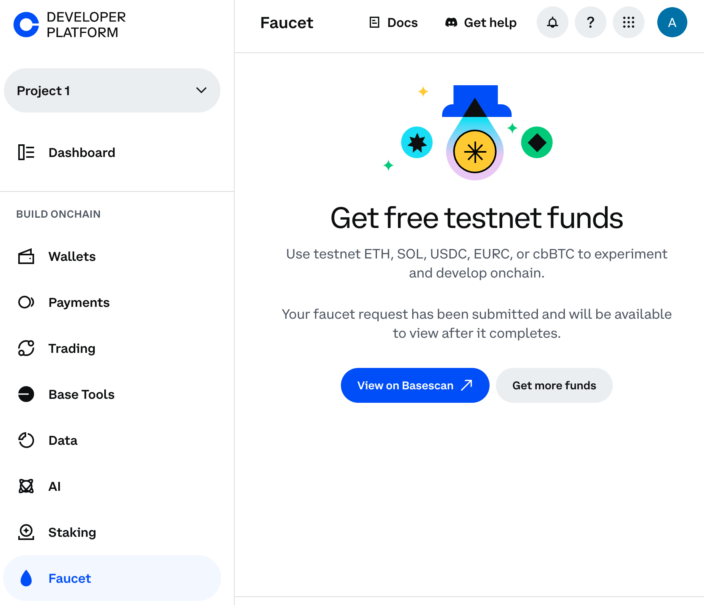
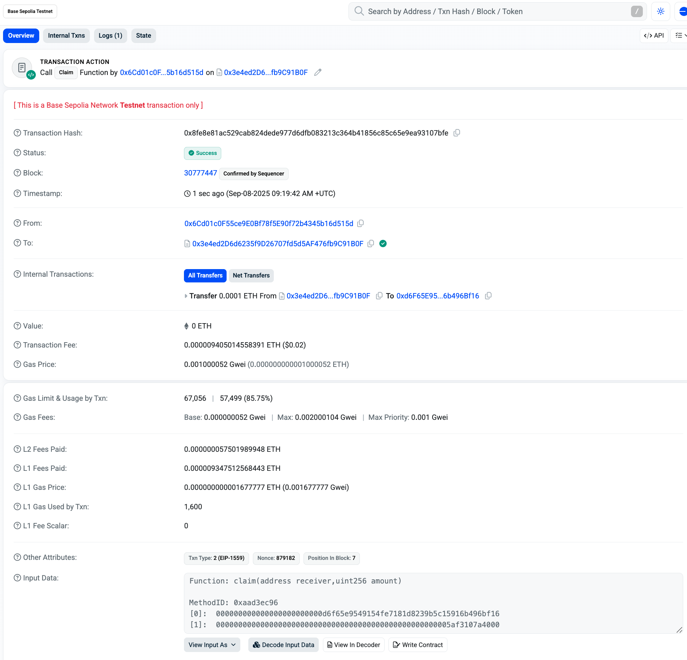

# Prerequisites for On-Chain Auction on Base

Before launching an on-chain auction for bonds on Base, you need to ensure all necessary prerequisites are in place. This document provides detailed information about each requirement.

## 1. Base Network Access


### What is Base?
Base is a secure, low-cost, developer-friendly Ethereum Layer 2 (L2) built by Coinbase. It offers the security of Ethereum with significantly lower gas fees and faster transaction times.

### Setting up Base Network Access

See [get-started here](https://docs.base.org/get-started/launch-token#technical-implementation-with-foundry)


#### For Testnet (Base Sepolia):
```
Network Name: Base Sepolia
RPC URL: https://sepolia.base.org
Chain ID: 84532
Currency Symbol: ETH
Block Explorer: https://sepolia.basescan.org
```

#### For Mainnet:
```
Network Name: Base
RPC URL: https://mainnet.base.org
Chain ID: 8453
Currency Symbol: ETH
Block Explorer: https://basescan.org
```

### Adding Base to MetaMask:
1. Open MetaMask
2. Click on the network dropdown
3. Select "Add Network" 
4. Enter the network details above
5. Click "Save"

## 2. ETH for Gas Fees

### Why ETH on Base?
Base uses ETH as its native currency for gas fees, just like Ethereum mainnet. However, transaction costs are significantly lower on Base.

### Getting ETH on Base:

#### For Testnet:
1. **Base Sepolia Faucet**: Visit https://www.coinbase.com/faucets/base-ethereum-goerli-faucet
2. **Bridge from Sepolia**: Use the official Base Bridge at https://bridge.base.org/

If you log into coinbase, you can [use their faucet here](https://portal.cdp.coinbase.com/products/faucet?projectId=acd8fe18-38ab-45b2-98a8-b3003d397c6a&address=&token=ETH&network=base-sepolia)


And view it [here](https://sepolia.basescan.org/tx/0x8fe8e81ac529cab824dede977d6dfb083213c364b41856c85c65e9ea93107bfe):


#### For Mainnet:
1. **Direct from Coinbase**: Withdraw ETH directly to Base from your Coinbase account
2. **Official Base Bridge**: Bridge ETH from Ethereum mainnet at https://bridge.base.org/
3. **Third-party bridges**: Various bridges support Base (ensure they're reputable)

### Recommended ETH Amount:
- **Testnet**: 0.1 ETH should be sufficient for extensive testing
- **Mainnet**: 
  - Contract deployment: ~0.01-0.05 ETH
  - Auction operations: ~0.001-0.005 ETH per transaction
  - Buffer: Keep at least 0.1 ETH for unexpected costs

## 3. Development Environment Setup

### Option 0: Base Setup

The other options were suggested by AI.

The ['lauch token'](https://docs.base.org/get-started/launch-token) page also provides a setup option.

Note: I've followed this option first, creating the project ['my-token-project'](./my-token-project)

To do that, I created an API key on [etherscan](https://etherscan.io/apidashboard)


### Option 1: Hardhat Setup

1. **Initialize project**:
```bash
mkdir auction-project
cd auction-project
npm init -y
npm install --save-dev hardhat
```

2. **Initialize Hardhat**:
```bash
npx hardhat init
```

3. **Install dependencies**:
```bash
npm install --save-dev @openzeppelin/contracts @nomicfoundation/hardhat-toolbox
```

4. **Configure hardhat.config.js**:
```javascript
require("@nomicfoundation/hardhat-toolbox");

module.exports = {
  solidity: "0.8.20",
  networks: {
    "base-sepolia": {
      url: process.env.BASE_SEPOLIA_RPC || "https://sepolia.base.org",
      accounts: process.env.PRIVATE_KEY ? [process.env.PRIVATE_KEY] : [],
    },
    "base-mainnet": {
      url: process.env.BASE_MAINNET_RPC || "https://mainnet.base.org",
      accounts: process.env.PRIVATE_KEY ? [process.env.PRIVATE_KEY] : [],
    }
  },
  etherscan: {
    apiKey: {
      "base-sepolia": process.env.BASESCAN_API_KEY || "",
      "base-mainnet": process.env.BASESCAN_API_KEY || "",
    },
    customChains: [
      {
        network: "base-sepolia",
        chainId: 84532,
        urls: {
          apiURL: "https://api-sepolia.basescan.org/api",
          browserURL: "https://sepolia.basescan.org"
        }
      }
    ]
  }
};
```

### Option 2: Foundry Setup

1. **Install Foundry**:
```bash
curl -L https://foundry.paradigm.xyz | bash
foundryup
```

2. **Initialize project**:
```bash
forge init auction-project
cd auction-project
```

3. **Configure foundry.toml**:
```toml
[profile.default]
src = "src"
out = "out"
libs = ["lib"]

[rpc_endpoints]
base_sepolia = "https://sepolia.base.org"
base_mainnet = "https://mainnet.base.org"

[etherscan]
base_sepolia = { key = "${BASESCAN_API_KEY}" }
base_mainnet = { key = "${BASESCAN_API_KEY}" }
```

## 4. Base RPC Endpoints

### Public RPC Endpoints:
- **Testnet**: https://sepolia.base.org
- **Mainnet**: https://mainnet.base.org

### Alternative RPC Providers:
For production use, consider using a dedicated RPC provider for better reliability:

1. **Alchemy**: https://www.alchemy.com/base
2. **Infura**: https://www.infura.io/networks/ethereum/base
3. **QuickNode**: https://www.quicknode.com/chains/base
4. **Ankr**: https://www.ankr.com/rpc/base/

### Setting up a Private RPC:
```bash
# Example with Alchemy
export BASE_SEPOLIA_RPC="https://base-sepolia.g.alchemy.com/v2/YOUR-API-KEY"
export BASE_MAINNET_RPC="https://base-mainnet.g.alchemy.com/v2/YOUR-API-KEY"
```

## 5. Wallet with Deployment Permissions

### Creating a Deployment Wallet:

1. **Generate a new wallet** (recommended for deployment):
```javascript
// Using ethers.js
const { ethers } = require('ethers');
const wallet = ethers.Wallet.createRandom();
console.log('Address:', wallet.address);
console.log('Private Key:', wallet.privateKey);
```

2. **Security Best Practices**:
- Never commit private keys to version control
- Use environment variables for sensitive data
- Consider using hardware wallets for mainnet deployments
- Use multisig wallets for production contracts

3. **Environment Variables Setup**:
Create a `.env` file:
```bash
# Deployment wallet private key (without 0x prefix)
PRIVATE_KEY=your_private_key_here

# RPC URLs
BASE_SEPOLIA_RPC=https://sepolia.base.org
BASE_MAINNET_RPC=https://mainnet.base.org

# BaseScan API key for contract verification
BASESCAN_API_KEY=your_basescan_api_key
```

4. **Install dotenv**:
```bash
npm install --save-dev dotenv
```

### Wallet Security Checklist:
- [ ] Private key stored securely (not in code)
- [ ] Using a dedicated deployment wallet
- [ ] Wallet funded with sufficient ETH
- [ ] Backup of private key stored securely
- [ ] Consider using a hardware wallet for mainnet
- [ ] Set up monitoring for the deployment address

## Verification Checklist

Before proceeding to Phase 1, ensure you have:

- [ ] Access to Base network (testnet and/or mainnet)
- [ ] Sufficient ETH for gas fees in your deployment wallet
- [ ] Development environment configured (Hardhat or Foundry)
- [ ] RPC endpoints configured and tested
- [ ] Deployment wallet created and secured
- [ ] Environment variables properly configured
- [ ] BaseScan API key for contract verification (optional but recommended)

## Next Steps

Once all prerequisites are met, proceed to [Phase 1.1: Contract Development](./1.1-contract-development.md).